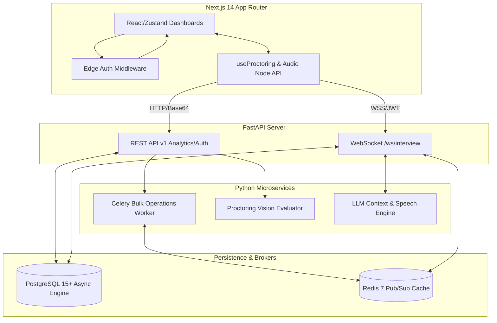

# ⚡ HireOps Platform
**Next-Generation, Agentic AI-Driven B2B SaaS Hiring Architecture**

Welcome to the HireOps monorepo. This platform redefines the enterprise "ATS" status quo by orchestrating asynchronous pipelines, edge-secured WebRTC proctoring, LLM explainability, and real-time Voice AI WebSockets—wrapped entirely inside an award-winning Next.js UI aesthetic.

---

## 🏛️ System Architecture



---

## 🚀 Local Development Spin-Up

To mount the foundational stack and begin iterating on your frontend interfaces or backend models, strictly rely on the pre-configured orchestration definitions below.

### 1. Launch the Backend Operations (Docker Engine required)

The `docker-compose.yml` natively provisions the `db`, `redis`, `api`, and `worker` systems within an isolated container network.

```bash
# Ensure you are at the monorepo root
cd hireops

# Provision the stack in detached mode
docker-compose up -d --build

# Verify container health-checks
docker-compose ps
```
*The FastAPI Swagger Docs will map locally to `http://localhost:8000/docs`.*

### 2. Mount the Frontend Interface

The Next.js 14 framework is highly coupled with the `framer-motion` aesthetic grids and the real-time `zustand` audio stores.

```bash
# Navigate to the frontend UI
cd frontend

# Install core system dependencies
npm install

# Start the optimized Hot-Reloading server
npm run dev
```
*The HireOps Dashboard experiences are available mapped to `http://localhost:3000`.*

---

## 🔒 Foundational Architecture Features

- **Multi-Tenant JWT Scoping**: Root API calls dynamically intercept the JWT for a bound `company_id`. DB reads are severely restricted across the SQLAlchemy async layer to structurally isolate HR/Managers purely to their domains.
- **Agentic Recharts Explainability**: Rich analytic widgets mount directly alongside the Candidate logic flow, injecting fairness audits against LLM reasoning grids.
- **Computer Vision WebRTC Telemetry**: An edge-level React `useProctoring` hook binds onto Page APIs whilst isolating encoded `<canvas>` Base64 snapshot streams down to a fast `cv2` engine detection handler.
- **Bi-Directional Websocket Streaming**: Dedicated Next.js stores communicate synchronously over `wss://` protocols, dynamically parsing incoming Text-To-Speech LLM chunks and piping them directly to standard AudioContext nodes.

---
_Architected successfully for Enterprise scale deployment._
