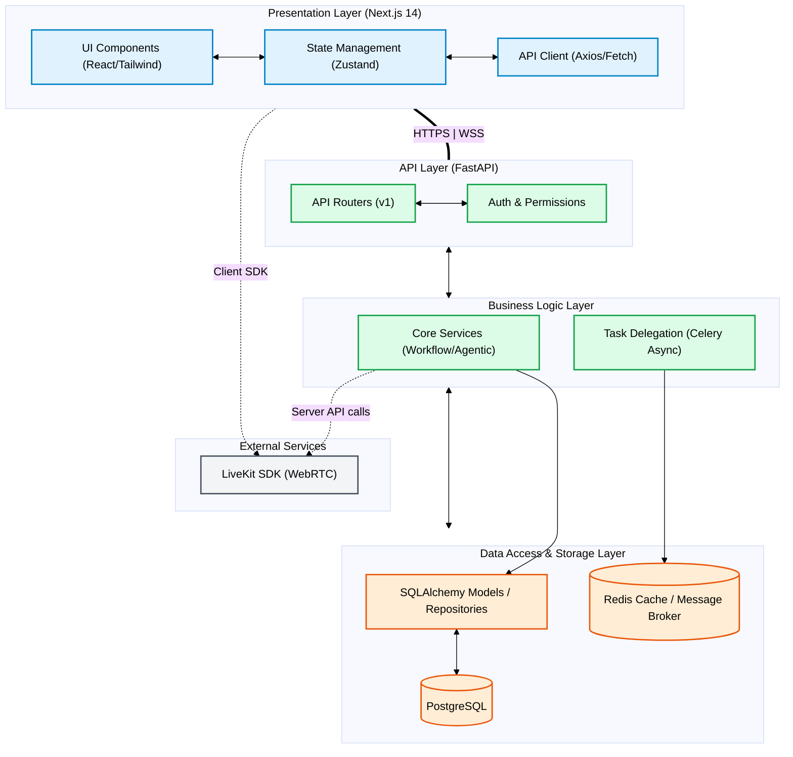
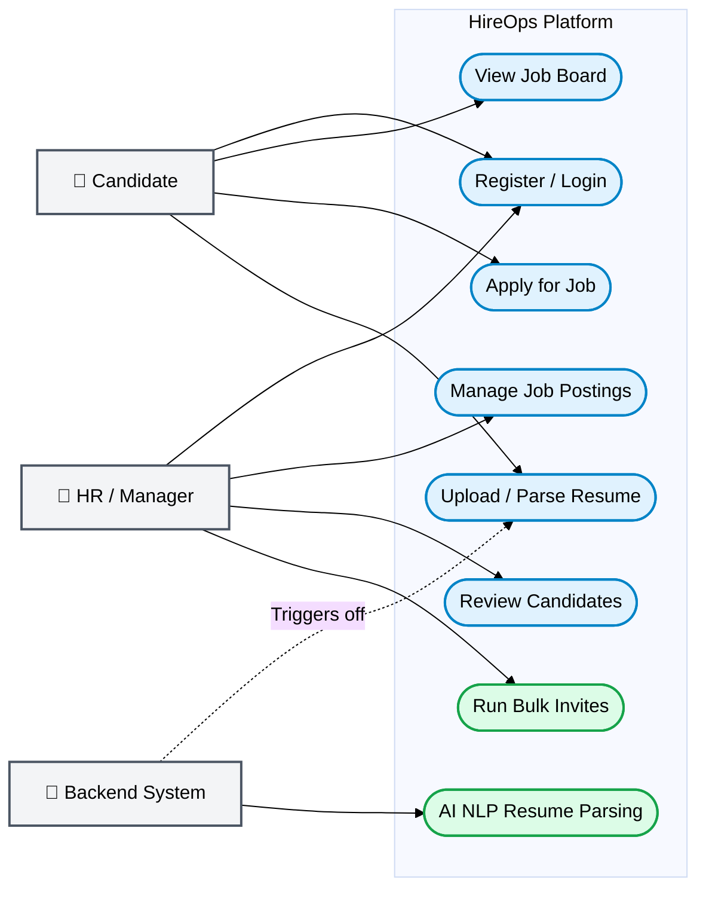
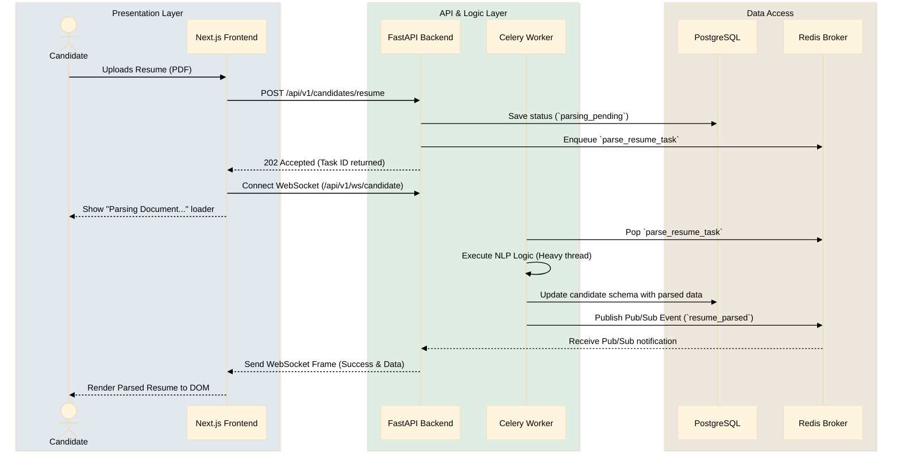
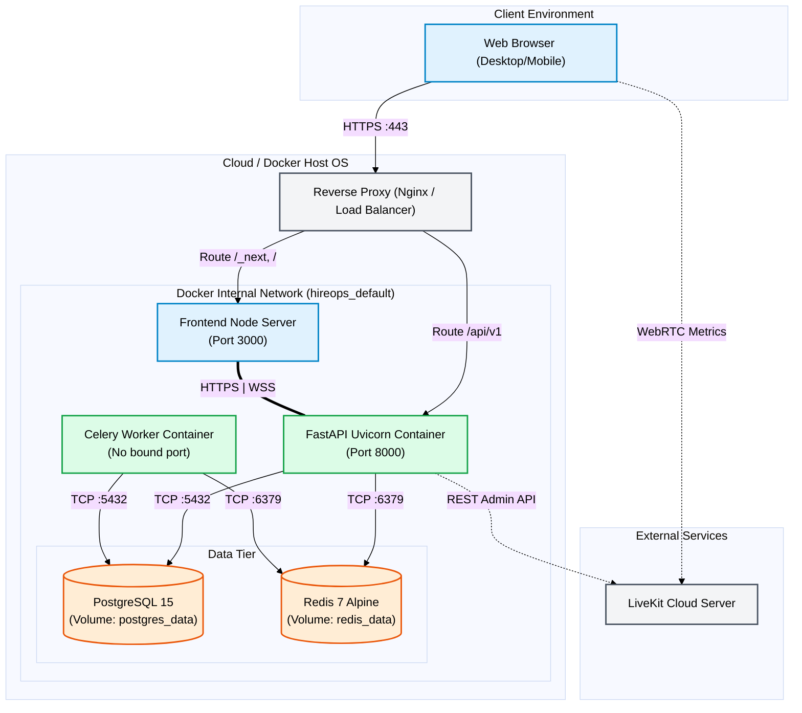

# HireOps Architecture Document

This document outlines the system architecture for **HireOps** across five primary viewpoints. These views ensure all aspects of the application—from logical separation and user interaction to runtime behavior and concrete infrastructure—are appropriately designed and documented.

---

## 1. Logical / Functional View
**Diagram Type**: Block Diagram / Layered Architecture  
**Purpose**: Shows system components and their relationships in a layered approach.

This diagram demonstrates how the codebase is logically separated. The Next.js frontend acts as the Presentation Layer, communicating via REST/WebSockets to the FastAPI API Gateway. Business logic is isolated in core services or delegated to background tasks.



---

## 2. Use Case View
**Diagram Type**: Use Case Diagram  
**Purpose**: Shows user interactions with the system and defines the system's boundary.

Displays the primary actors (Candidates and HR/Managers) interacting with the HireOps platform, as well as backend system actors (like the AI System) that trigger automated background tasks.



---

## 3. Implementation / System View
**Diagram Type**: Component Diagram  
**Purpose**: Details the physical code structure, modules, and packages.

This view highlights how the application is physically split into different services, frameworks, and modules inside the monorepo, including Docker containers and internal dependencies.

```mermaid
%%{init: {'theme': 'base', 'themeVariables': { 'background': '#ffffff', 'primaryTextColor': '#000000', 'lineColor': '#000000' }}}%%
classDiagram
    class FrontendApp {
        <<Next.js 14 App Router>>
        +(auth)
        +(tenant) dashboard
        +jobs board
    }
    class APIClient {
        <<React Hooks / Lib>>
        +fetch()
    }
    class FastAPIServer {
        <<Web Framework>>
        +main.py
    }
    class APIRouters {
        <<Endpoints>>
        +api/v1/auth
        +api/v1/jobs
        +api/v1/candidates
    }
    class Services {
        <<Domain Logic>>
    }
    class CeleryWorker {
        <<Background Worker>>
        +parse_resume_task()
        +send_invites_task()
    }
    class LiveKitCloud {
        <<External WebRTC Service>>
        +video_rooms
    }
    class Database {
        <<PostgreSQL>>
    }
    class RedisBroker {
        <<Redis>>
    }

    style FrontendApp fill:#e0f2fe,stroke:#0284c7,color:#000000
    style APIClient fill:#e0f2fe,stroke:#0284c7,color:#000000
    style FastAPIServer fill:#dcfce7,stroke:#16a34a,color:#000000
    style APIRouters fill:#dcfce7,stroke:#16a34a,color:#000000
    style Services fill:#dcfce7,stroke:#16a34a,color:#000000
    style CeleryWorker fill:#dcfce7,stroke:#16a34a,color:#000000
    style LiveKitCloud fill:#f3f4f6,stroke:#4b5563,color:#000000
    style Database fill:#ffedd5,stroke:#ea580c,color:#000000
    style RedisBroker fill:#ffedd5,stroke:#ea580c,color:#000000

    FrontendApp --> APIClient : Uses
    FrontendApp -.-> LiveKitCloud : Direct Media Stream
    APIClient --> FastAPIServer : HTTP JSON Request
    FastAPIServer *-- APIRouters : Mounts
    APIRouters --> Services : Calls
    Services --> CeleryWorker : Dispatches via Broker
    Services --> Database : Reads / Writes
    Services -.-> LiveKitCloud : Room Token Generation
    CeleryWorker --> RedisBroker : Listens for Tasks
    FastAPIServer --> RedisBroker : Publishes Events
```

---

## 4. Process / Thread View
**Diagram Type**: Sequence Diagram  
**Purpose**: Shows runtime behavior, workflows, and threads for a complex process.

This diagram traces a typical complex asynchronous workflow: a candidate uploading a resume, which is parsed by an AI backend worker while the frontend listens for real-time progress updates.



---

## 5. Deployment View
**Diagram Type**: Deployment Diagram  
**Purpose**: Shows servers, nodes, infrastructure configuration, and networking.

This illustrates how the platform runs natively inside a Docker Compose environment (or analogous Cloud/Kubernetes cluster) showing ports, internal networking, and external facing interfaces.


